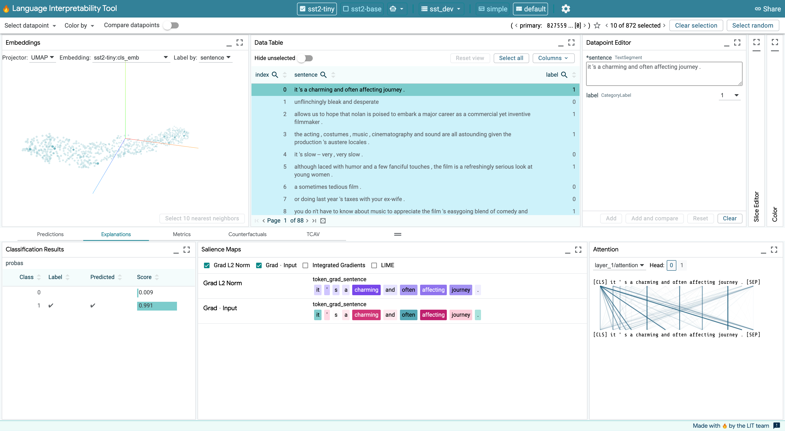

# 🔥 Language Interpretability Tool (LIT)

<!--* freshness: { owner: 'lit-dev' reviewed: '2020-08-04' } *-->

The Language Interpretability Tool (LIT) is a visual, interactive
model-understanding tool for NLP models.

LIT is built to answer questions such as:

*   **What kind of examples** does my model perform poorly on?
*   **Why did my model make this prediction?** Can this prediction be attributed
    to adversarial behavior, or to undesirable priors in the training set?
*   **Does my model behave consistently** if I change things like textual style,
    verb tense, or pronoun gender?



LIT supports a variety of debugging workflows through a browser-based UI.
Features include:

*   **Local explanations** via salience maps, attention, and rich visualization
    of model predictions.
*   **Aggregate analysis** including custom metrics, slicing and binning, and
    visualization of embedding spaces.
*   **Counterfactual generation** via manual edits or generator plug-ins to
    dynamically create and evaluate new examples.
*   **Side-by-side mode** to compare two or more models, or one model on a pair
    of examples.
*   **Highly extensible** to new model types, including classification,
    regression, span labeling, seq2seq, and language modeling. Supports
    multi-head models and multiple input features out of the box.
*   **Framework-agnostic** and compatible with TensorFlow, PyTorch, and more.

For a broader overview, check out [our paper](https://arxiv.org/abs/2008.05122) and the
[user guide](documentation/user_guide.md).

## Documentation

*   [User Guide](documentation/user_guide.md)
*   [Developer Guide](documentation/development.md)
*   [FAQ](documentation/faq.md)
*   [Release notes](./RELEASE.md)

## Download and Installation

LIT can be installed via pip, or can be built from source. Building from source
is necessary if you wish to update any of the front-end or core back-end code.

### Install from source

Download the repo and set up a Python environment:

```sh
git clone https://github.com/PAIR-code/lit.git ~/lit

# Set up Python environment
cd ~/lit
conda env create -f environment.yml
conda activate lit-nlp
conda install cudnn cupti  # optional, for GPU support
conda install -c pytorch pytorch  # optional, for PyTorch

# Build the frontend
pushd lit_nlp; yarn && yarn build; popd
```

Note: if you see [an error](https://github.com/yarnpkg/yarn/issues/2821)
running yarn on Ubuntu/Debian, be sure you have the
[correct version installed](https://yarnpkg.com/en/docs/install#linux-tab).

### pip installation

```sh
pip install lit-nlp
```

The pip installation will install all necessary prerequisite packages for use
of the core LIT package. It also installs the code to run our demo examples.
It does not install the prerequisites for those demos, so you need to install
those yourself if you wish to run the demos. See
[environment.yml](./environment.yml) for the list of all packages needed for
running the demos.

## Running LIT

### Quick-start: classification and regression

To explore classification and regression models tasks from the popular [GLUE benchmark](https://gluebenchmark.com/):

```sh
python -m lit_nlp.examples.glue_demo --port=5432 --quickstart
```

Navigate to http://localhost:5432 to access the LIT UI. 

Your default view will be a 
[small BERT-based model](https://arxiv.org/abs/1908.08962) fine-tuned on the
[Stanford Sentiment Treebank](https://nlp.stanford.edu/sentiment/treebank.html),
but you can switch to 
[STS-B](http://ixa2.si.ehu.es/stswiki/index.php/STSbenchmark) or [MultiNLI](https://cims.nyu.edu/~sbowman/multinli/) using the toolbar or the gear icon in 
the upper right.


### Quick start: language modeling

To explore predictions from a pretrained language model (BERT or GPT-2), run:

```sh
python -m lit_nlp.examples.pretrained_lm_demo --models=bert-base-uncased \
  --port=5432
```

And navigate to http://localhost:5432 for the UI.

### More Examples

See [lit_nlp/examples](./lit_nlp/examples). Run similarly to the above:

```sh
python -m lit_nlp.examples.<example_name> --port=5432 [optional --args]
```

## User Guide

To learn about LIT's features, check out the [user guide](documentation/user_guide.md), or
watch this [video](https://www.youtube.com/watch?v=CuRI_VK83dU).

## Adding your own models or data

You can easily run LIT with your own model by creating a custom `demo.py`
launcher, similar to those in [lit_nlp/examples](./lit_nlp/examples). The basic
steps are:

*   Write a data loader which follows the
    [`Dataset` API](documentation/python_api.md#datasets)
*   Write a model wrapper which follows the [`Model` API](documentation/python_api.md#models)
*   Pass models, datasets, and any additional
    [components](documentation/python_api.md#interpretation-components) to the LIT server
    class

For a full walkthrough, see
[adding models and data](documentation/python_api.md#adding-models-and-data).

## Extending LIT with new components

LIT is easy to extend with new interpretability components, generators, and
more, both on the frontend or the backend. See the
[developer guide](documentation/development.md) to get started.

## Citing LIT

If you use LIT as part of your work, please cite [our EMNLP paper](https://arxiv.org/abs/2008.05122):

```
@misc{tenney2020language,
    title={The Language Interpretability Tool: Extensible, Interactive Visualizations and Analysis for {NLP} Models},
    author={Ian Tenney and James Wexler and Jasmijn Bastings and Tolga Bolukbasi and Andy Coenen and Sebastian Gehrmann and Ellen Jiang and Mahima Pushkarna and Carey Radebaugh and Emily Reif and Ann Yuan},
    booktitle = "Proceedings of the 2020 Conference on Empirical Methods in Natural Language Processing: System Demonstrations",
    year = "2020",
    publisher = "Association for Computational Linguistics",
    pages = "107--118",
    url = "https://www.aclweb.org/anthology/2020.emnlp-demos.15",
}
```

## Disclaimer

This is not an official Google product.

LIT is a research project, and under active development by a small team.
There will be some bugs and rough edges, but we're releasing at an early stage
because we think it's pretty useful already. We want LIT to be an open platform,
not a walled garden, and we'd love your suggestions and feedback - drop us a
line in the [issues](https://github.com/pair-code/lit/issues).
